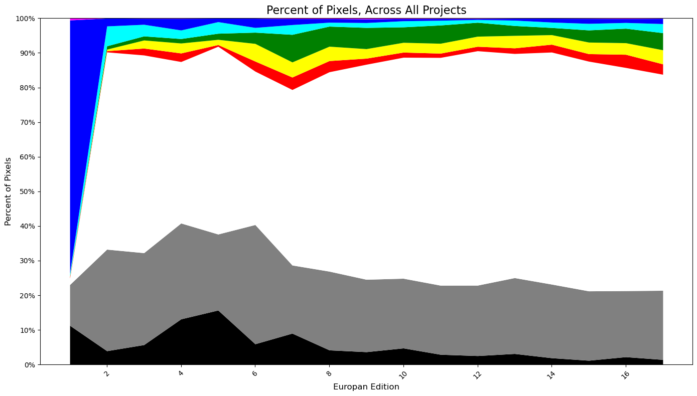

# scrapy
This project analyzes the evolution of color usage in competition boards submitted to the Europan architecture competition across different editions. It processes thousands of project images, classifies pixel colors, and visualizes trends using a stacked area chart.

## Project Structure

```
project_root/
│
├── europan_competitions_archive.xlsx    # Metadata file mapping projects to Europan editions
├── projects_archive/                    # Folder of project subdirectories
│   └── <project_id>/
│       └── pictures/
│           └── sorted_colors.json       # Color data per image
│       └── merged_sorted_colors.json    # Merged data per project
│
├── europan_sessions_colors/             # Merged color data per edition
│   └── europan_E14_colors.json
│   └── europan_E15_colors.json
│   └── ...
├── europan.ipynb                        # Main analysis notebook
└── color_evolution_by_edition.csv       # Cached DataFrame for fast plotting (optional)

```

## Setup

This library usese python 3.13.0. Start by creating virtual Environment using: 

``` 
python -m venv .venv 
.venv/Scripts/activate
    
```

Install libraries using: 

```pip install -r requirements.txt ```

## Install the Europan Page to Scrape: 

Download an html file from: https://www.europan-europe.eu/fr/project-and-processes/ and save as project-and-processes.html. Make sure to scroll all the way down to get all Europan Projects. 

## Use Europan.ipynb to create this graph: 



